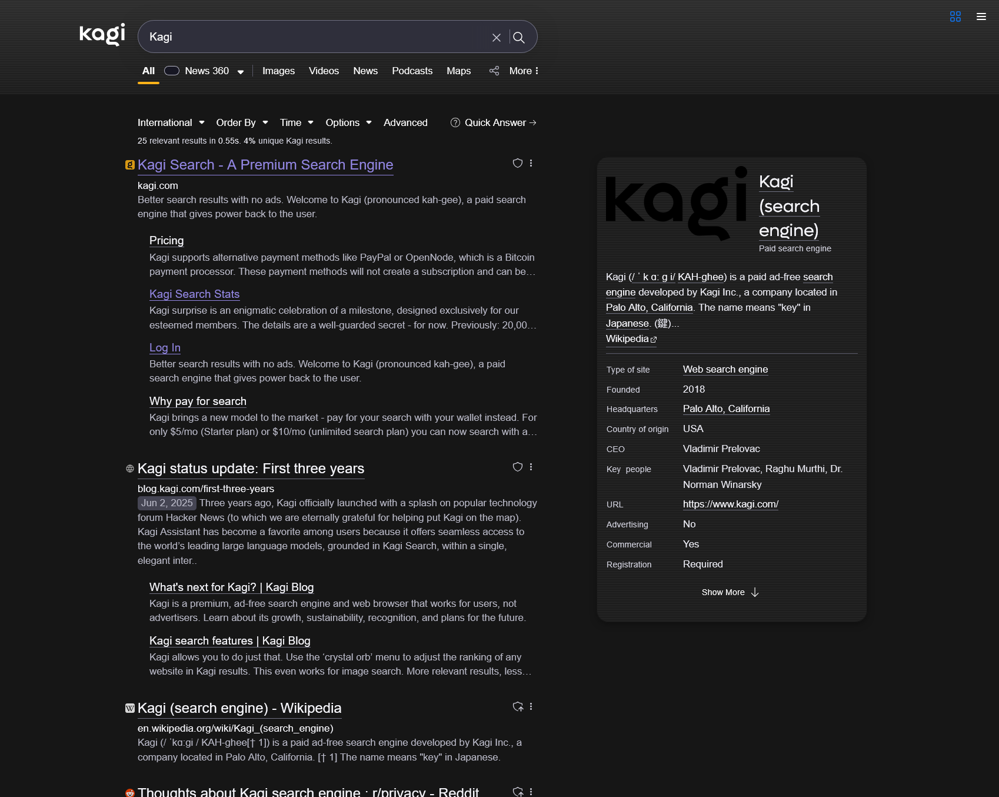

# An OS X inspired pinstripe theme for Kagi!
Just copy the CSS from custom.css into your kagi user at [Settings → Appearance](https://kagi.com/settings/appearance). 

## Auto Light & Dark mode
This will change automatically based on your system settings. So if your system is set to light, it will show the light version.

# Using this theme
1. Go to [Appearance](https://kagi.com/settings/appearance)
2. Change theme to **"Default"** not **"Light"** or **"Dark"**
3. Set your **"Show Results"** to **"Center"**, it will break set to left.
3. [Enable Custom CSS & Paste custom.css](https://kagi.com/settings/custom_css)
4. Save changes and profit?

# Buggy?
Will probably be because I'm useless at this.

# Screenshot

Light mode looks like this

Dark mode looks like this

