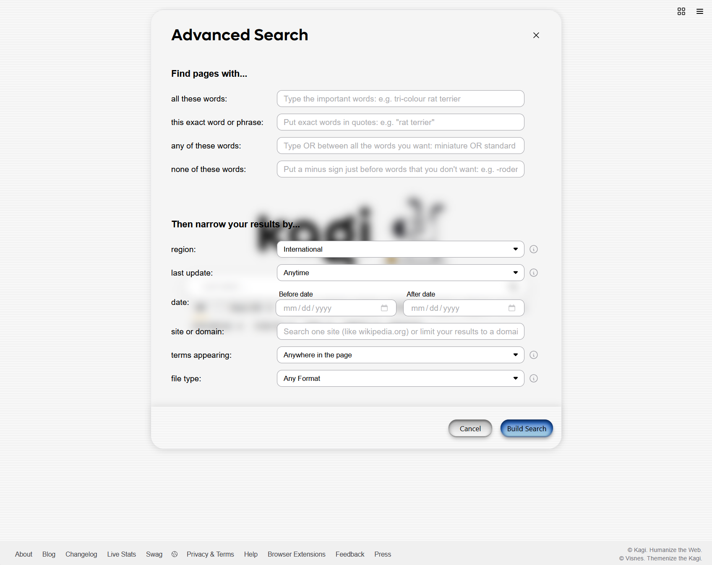
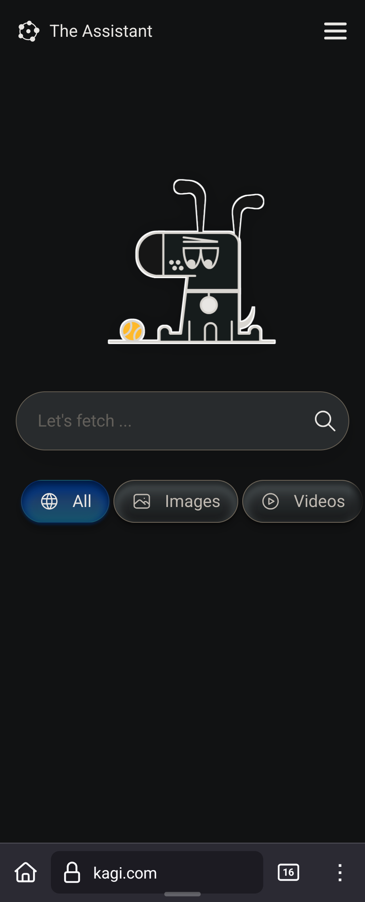

# An OS X inspired aqua theme for Kagi!
A custom theme for the [Kagi the search engine](https://kagi.com) that's inspired by old school Apple's OS X Aqua theme.

## Auto Light & Dark mode
This will change automatically based on your system settings. So if your system is set to light, it will show the light version. **For this to work, choose "Default" theme (see below).**

# Using this theme

<strong>⚠️ If you don't do the following, the theme will look trash! ⚠️</strong>

1. Go to [Appearance](https://kagi.com/settings/appearance)
2. Change theme to **"Default"** not **"Light"** or **"Dark"**
3. [Enable Custom CSS & Paste custom.css](https://kagi.com/settings/custom_css)
4. Save changes and profit?

# Bugs
- A border with a drop shadow shows up across the screen if you unfocus the search field in dark mode (only on the landing page)
- ~~Can't get the mini toggle back next to "all" and "News 360" because I'm screwing around with the toggle switches for the side panel~~
- ~~A white square shows up next to the X in the search field on a result page, only when it's in focus~~
- ~~The auto suggest box is way to hard to read, and looks kinda ass.~~

# Working on
- The bugs above
- Clean up things. This is a mess...

# Screenshots
<h3>Light mode on desktop</h3>
<table>
  <tr>
    <td></td>
    <td></td>
    <td></td>
  </tr>
</table>

<h3>Dark mode on desktop</h3>
<table>
  <tr>
    <td></td>
    <td></td>
    <td></td>
  </tr>
</table>

<h3>Light mode on mobile</h3>
<table>
  <tr>
    <td></td>
    <td></td>
    <td></td>
  </tr>
</table>

<h3>Dark mode on mobile</h3>
<table>
  <tr>
    <td></td>
    <td></td>
    <td></td>
  </tr>
</table>

# Credits
- The [button CSS](https://codepen.io/andrewmillen/pen/RwqBMrO) is made by [Andrew Millen](https://codepen.io/andrewmillen/)
